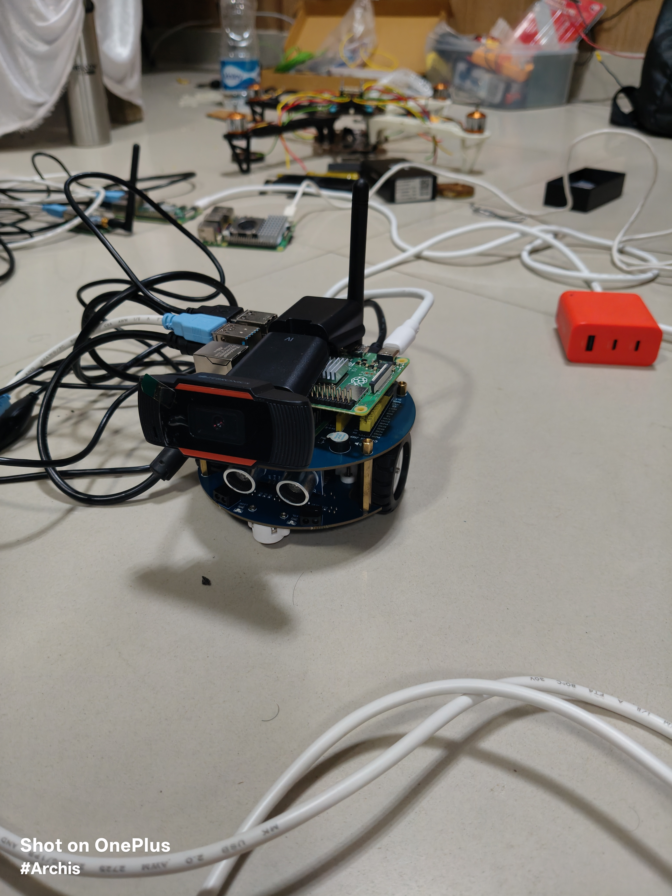
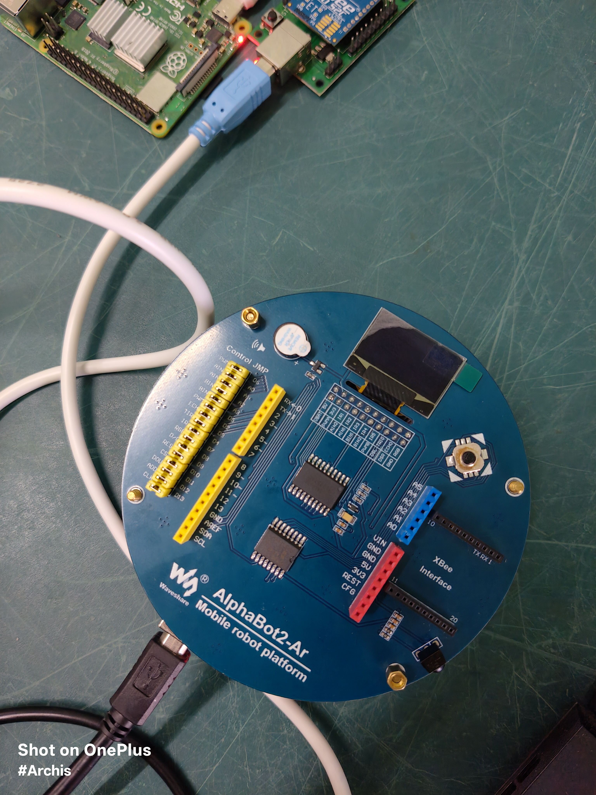
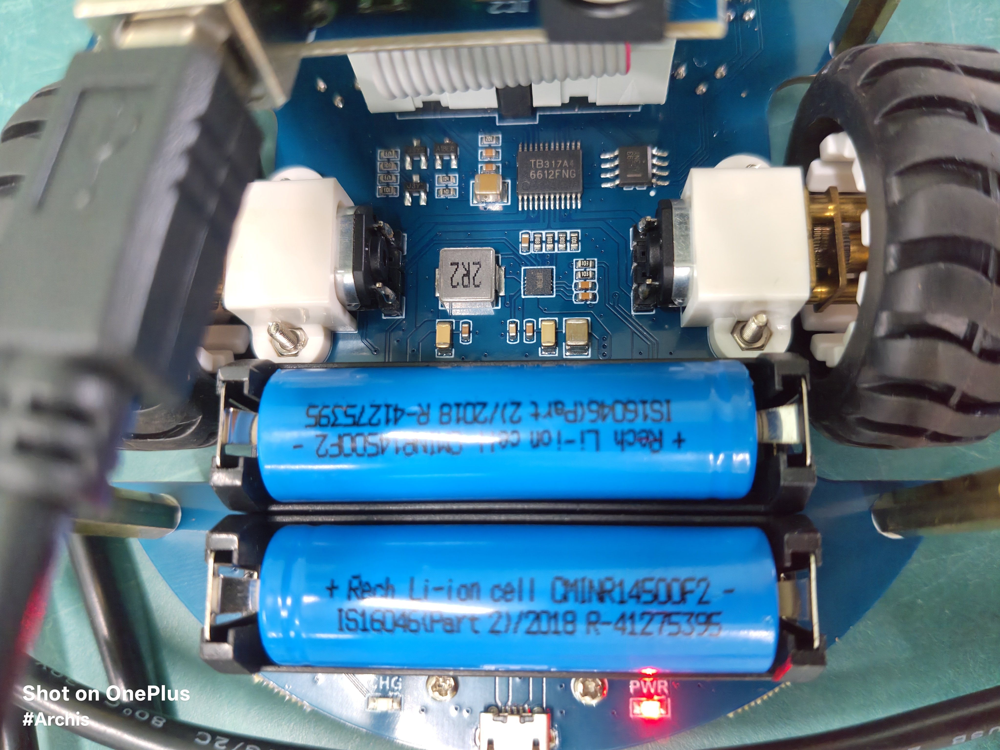
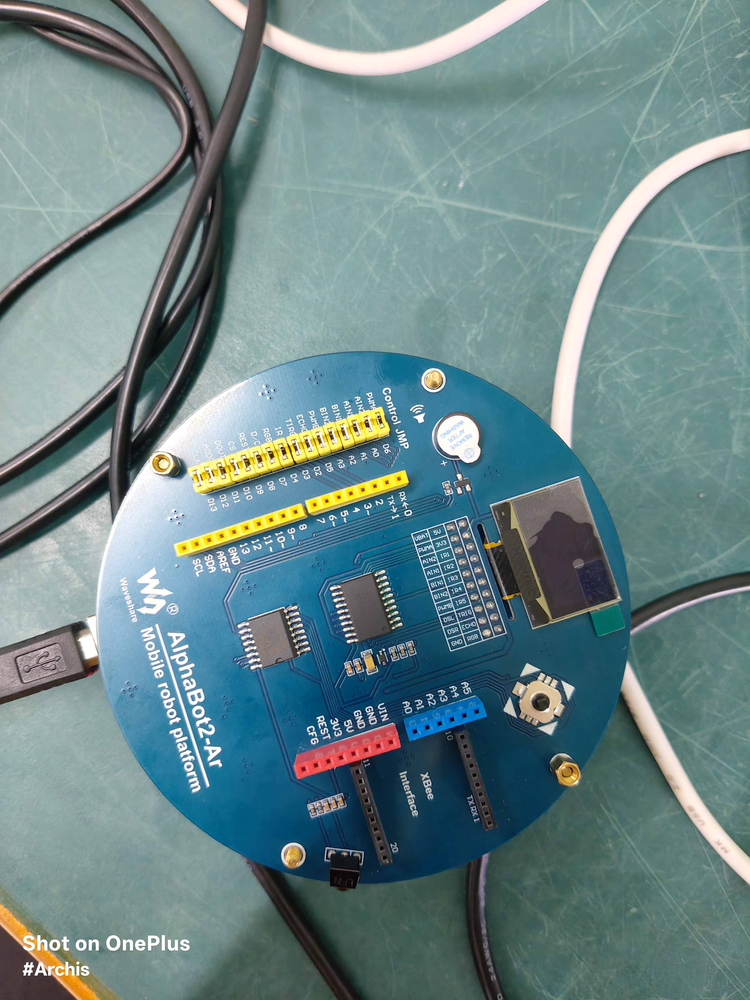
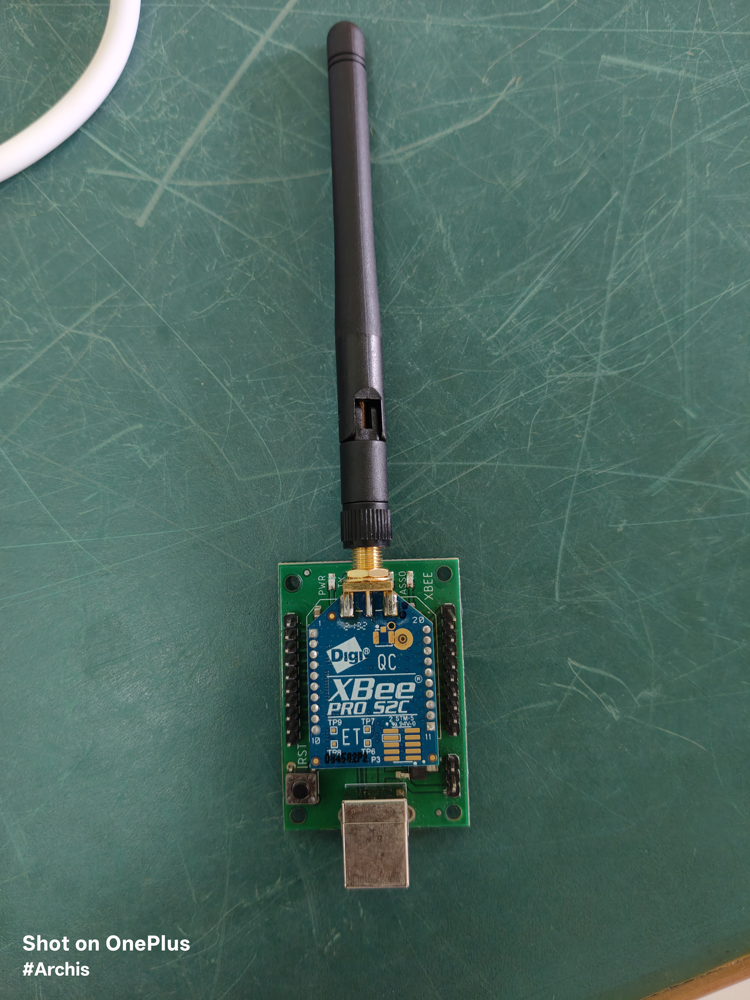
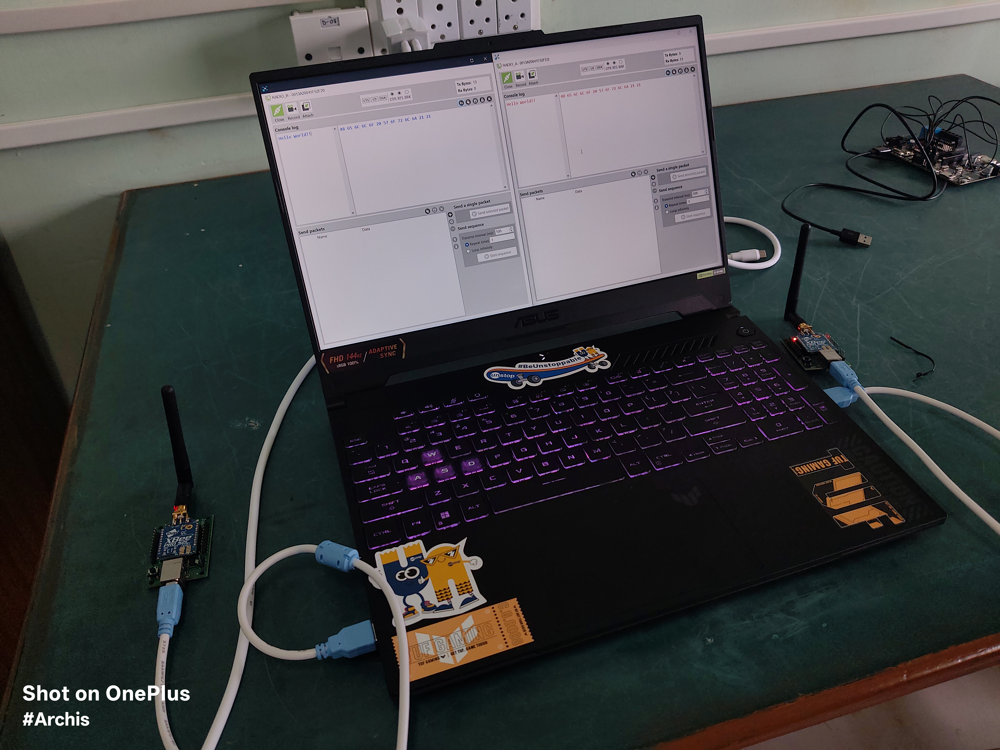
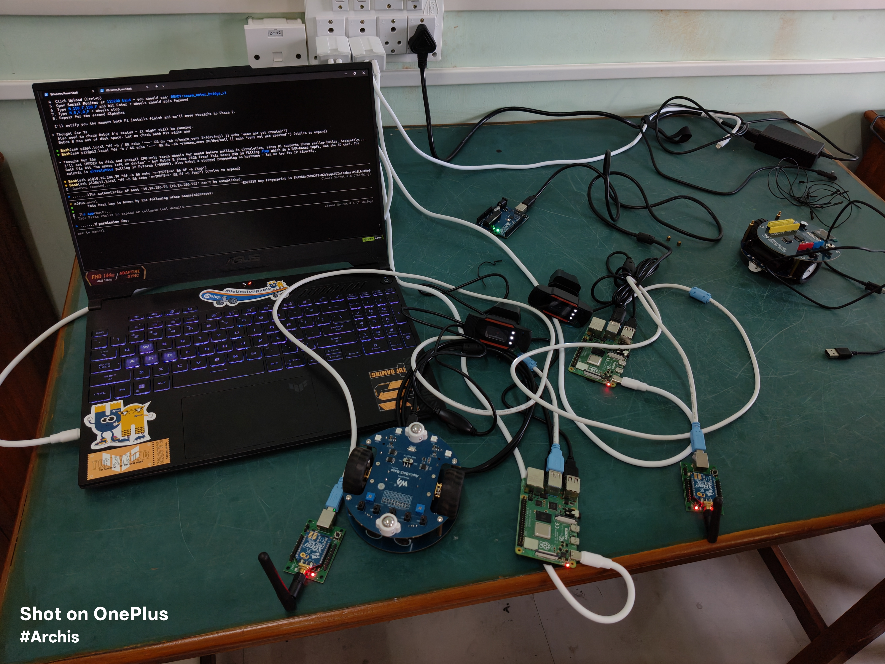
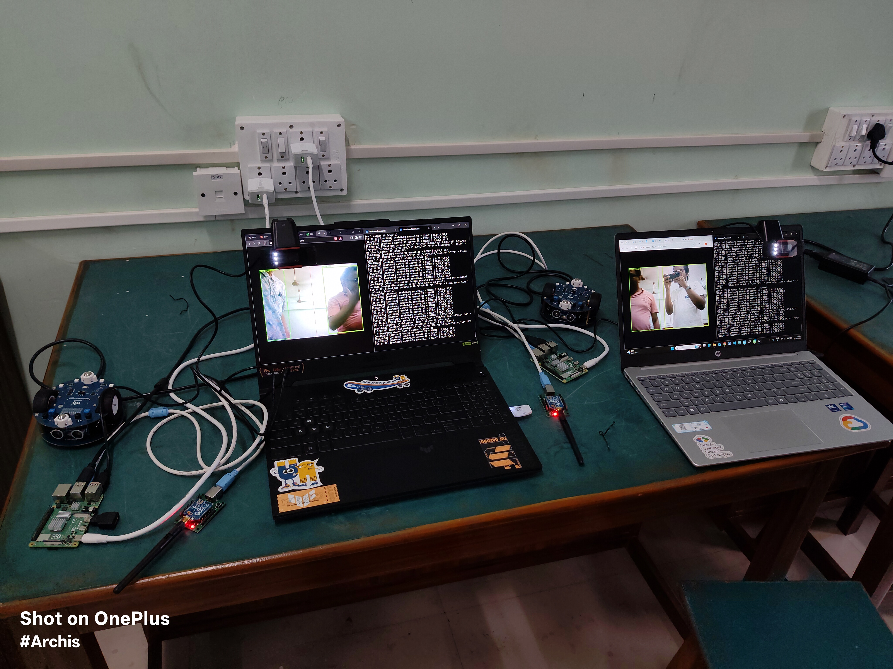
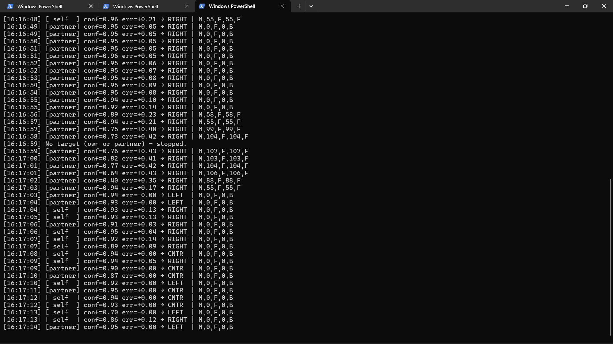

# Swarm Ground Proof-of-Concept (POC)

This repository contains the software stack for a two-robot ground swarm proof-of-concept. It serves as the foundation for autonomous coordination, person-tracking, and XBee-based communication between two equal robotic peers.

<p align="center">
  
  <br><em>Fully integrated AlphaBot2-Ar ground node — Raspberry Pi 4B companion computer, tracking camera, and XBee-PRO S2C wireless mesh transceiver.</em>
</p>

## Hardware Stack (Per Robot)
*   **Base:** Waveshare AlphaBot2-Base (contains TB6612FNG motor driver & 2× 14500 Li-ion batteries)
*   **Adapter Shield:** AlphaBot2-Ar (Arduino UNO compatible adapter)
*   **Microcontroller:** Arduino UNO R3 (mounted on the AlphaBot2-Ar shield)
*   **Companion Computer:** Raspberry Pi 4B (4GB RAM)
*   **Vision:** USB Webcam (Jieli Technology) — `/dev/video0`
*   **RF Communication:** XBee-PRO S2C (Zigbee TH PRO, 9600 baud, Transparent mode) — `/dev/ttyUSB0`
*   **Motor Bridge:** Arduino UNO R3 connected via USB — `/dev/ttyUSB1`

<p align="center">
  
  
  <br><em>Left: Top view of assembled ground node with Pi 4B serial bridge. Right: Bottom view showing differential drive motors and dual 14500 Li-ion cells.</em>
</p>

## Critical Hardware Discoveries & Pin Mappings
The official documentation for the AlphaBot2-Ar is misleading regarding motor pins. The true pin mapping is defined by the yellow "Control JMP" jumper matrix on the AlphaBot2-Ar shield itself.

<p align="center">
  
  <br><em>AlphaBot2-Ar adapter shield top view — the yellow "Control JMP" jumper matrix (top-left) physically determines which Arduino pins drive the motor direction logic. XBee interface slot (right) and OLED socket also visible.</em>
</p>

**The motor direction pins are wired to the Arduino's Analog pins:**
*   **Left Motor (A):**
    *   PWM: `D6`
    *   AIN1: `A1`
    *   AIN2: `A0`
*   **Right Motor (B):**
    *   PWM: `D5`
    *   BIN1: `A2`
    *   BIN2: `A3`

*(Note: The Arduino firmware handles these analog pins as digital outputs using `pinMode(A0, OUTPUT)`).*

**Right motor is physically mounted mirrored** — direction logic is inverted in software (`INVERT_RIGHT = True` in `swarm_bot.py`). Do NOT change physical wiring.


## XBee Configuration (Set in XCTU — do not change)
| Setting | Value |
|---|---|
| Function Set | ZIGBEE TH PRO |
| PAN ID | `3333` |
| AP (API Mode) | `0` (Transparent mode) |
| Baud Rate | `9600` |
| Radio A DL | `41F52F20` (points to B) |
| Radio B DL | `41F52FD2` (points to A) |

<p align="center">
  
  <br><em>Digi XBee PRO S2C RF module (Zigbee TH PRO) — the mesh radio used by both ground nodes.</em>
</p>

<p align="center">
  
  
  <br><em>Bidirectional XBee serial telemetry testing between the two ground nodes.</em>
</p>

<p align="center">
  
  <br><em>Full telemetry loop test — laptop transmitting to the ground node, verifying the transparent-mode JSON pipeline end-to-end.</em>
</p>

## Power & Thermal Considerations
Running computer vision models (YOLO) forces the Raspberry Pi 4 CPU to 100% utilisation. Because the Pi simultaneously powers a webcam, Arduino, and XBee via USB, this creates massive instantaneous current spikes.

*   **Symptoms:** If the wall adapter or battery pack cannot supply 5V @ 3A (15W) instantly, the Pi will suffer a brown-out (Wi-Fi drop, crash, or hard reboot).
*   **Root Cause:** SD card can corrupt during a brown-out crash. Fix: remove SD card, scan with Windows `chkdsk`, reinsert.
*   **Solution:** YOLO NCNN inference is throttled to `num_threads=1` inside the camera thread in `swarm_bot.py`. This limits CPU usage, giving ~2 FPS but ensuring power stability. The `YoloNcnn` wrapper defaults to 4 threads — always override explicitly.

## Software Architecture

### 1. Arduino Motor Bridge (`phase1_arduino/sketch_pi_motor_bridge/`)
*   Compiled using PlatformIO (`pio run`). Board: `uno`.
*   Listens on `/dev/ttyUSB1` at **115200 baud** for ASCII commands from the Pi.
*   **Motor command protocol:** `M,<leftSpeed>,<leftDir>,<rightSpeed>,<rightDir>` (e.g. `M,120,F,120,B`)
*   **Display command protocol:** `D,<line1>,<line2>` — writes two lines to the onboard SSD1306 OLED (128×64, I2C address `0x3C`). OLED init is non-fatal; if absent, `WARN:oled_init_failed` is printed and the sketch continues motor-only.
*   Includes a **2-second hardware watchdog** — stops motors automatically if no command received.
*   Responds `OK` on success and `ERR:<reason>` on bad input.
*   Firmware version: `READY:swarm_motor_bridge_v3`

> [!NOTE]
> `swarm_bot.py` currently does **not** send `D,` display commands — OLED support was removed from the Python layer to reduce I2C overhead. The Arduino firmware retains the capability for future use.

### 2. YOLO NCNN Vision Engine (`shared/yolo_ncnn.py`)
*   Custom Python wrapper around the `ncnn` library — no PyTorch, no Ultralytics.
*   Runs YOLO11n FP16 model directly on the Pi's ARM CPU at 320×320 input.
*   Detects persons (COCO class 0 only), returns `Detection` objects with `norm_cx`, `norm_cy`, `confidence`, and pixel bounding box.
*   `track_id` is always `-1` — no persistent tracker is implemented yet.

### 3. XBee Transport Layer (`shared/xbee_transport.py`)
*   Thread-safe JSON transport over XBee transparent serial.
*   `send(dict)` → serialises to newline-terminated JSON and writes to serial.
*   `recv()` → non-blocking read, returns parsed dict or `None`. Clears RX buffer on malformed/corrupted packets to prevent cascading JSON decode failures.
*   `link_alive()` → safety watchdog, returns `False` if no packet received in 2 seconds.

### 4. Swarm Bot — Symmetric Peer (`phase4_tracking/swarm_bot.py`)
*   **The main deployed script.** Runs identically on both robots — no master, no slave.
*   3 parallel threads per robot:
    *   **Camera thread:** YOLO detection → updates local state → broadcasts over XBee.
    *   **XBee RX thread:** Receives partner detections → updates partner state. Ignores own echoes by filtering on robot ID.
    *   **Stream thread (optional):** MJPEG HTTP server on port `5000`. Only active when `--stream` flag is passed. Fully decoupled — never blocks YOLO or motors.
*   **Motor tuning constants (hardware-verified):**

| Constant | Value | Meaning |
|---|---|---|
| `KP_TURN` | `250` | Proportional gain for pixel-error → PWM |
| `MAX_SPEED` | `120` | PWM hard cap (Arduino also caps at 200) |
| `MIN_SPEED` | `80` | Minimum PWM to overcome stall torque |
| `DEADZONE_STOP` | `0.05` | Stop turning when centre error < this |
| `DEADZONE_START` | `0.10` | Start turning when centre error > this |
| `INVERT_RIGHT` | `True` | Right motor direction physically mirrored |

*   **Staleness watchdog:** Own camera detections expire after 1 second; partner XBee detections after 2 seconds. If both are stale, motors stop immediately.
*   **Decision logic:** If both robots see a person, whichever has higher YOLO confidence wins. If only one robot sees a person, it drives and the partner follows its broadcast.

### 5. Debug Tools (`phase3_vision/`, `phase4_tracking/`)
*   `yolo_stream.py` — MJPEG stream only, no motors.
*   `swarm_tracker.py` — single-robot tracker with no XBee, useful for motor tuning in isolation.
*   `swarm_tracker_stream.py` — tracker + live MJPEG stream, for visual debugging.

> [!WARNING]
> Run debug stream scripts **before** deploying `swarm_bot.py`, not simultaneously. On a single Pi, two camera opens will conflict.

## Network & Access
| Robot | Hostname | Current IP (DHCP) | SSH User | Password |
|---|---|---|---|---|
| **Robot A** | `pi.local` | `10.219.37.74` | `pi` | `raspberry` |
| **Robot B** | `pi2.local` | `10.219.37.184` | `pi2` | `raspberry` |

> [!WARNING]
> IPs are assigned by DHCP and may change if the router restarts or the bots connect to a different network. Always verify with `ping pi.local` before assuming a fixed IP.

## How to Run

### Option 1 — Windows PowerShell launcher (recommended)
```powershell
# From the repo root — launches both robots in separate terminal windows:
.\start_swarm.ps1

# Without the MJPEG stream (lower CPU load):
.\start_swarm.ps1 -NoStream
```

Stream URLs when `--stream` is active:
- Robot A: `http://10.219.37.74:5000`
- Robot B: `http://10.219.37.184:5000`

### Option 2 — Manual SSH (two separate terminals)
```bash
# Robot A
ssh pi@10.219.37.74
PYTHONUNBUFFERED=1 ~/swarm_venv/bin/python ~/swarm_bot.py --id A --stream

# Robot B
ssh pi2@10.219.37.184
PYTHONUNBUFFERED=1 ~/swarm_venv/bin/python ~/swarm_bot.py --id B --stream
```

### Stop both robots
```bash
# Kill gracefully on each Pi (atexit handler sends stop command to Arduino):
ssh pi@10.219.37.74 "pkill -2 -f swarm_bot.py"
ssh pi2@10.219.37.184 "pkill -2 -f swarm_bot.py"
```

> [!CAUTION]
> Do **not** use `pkill -9`. The graceful shutdown in the `finally` block sends `M,0,F,0,F` to the Arduino before exiting. `pkill -9` skips this and may leave motors running.

### Reflash Arduino firmware
```powershell
# On Windows — from repo root:
cd phase1_arduino
pio run
# Then SCP the .hex and flash via avrdude over SSH (see phase1 notes)
```

## Phase Map & Progress
*   [x] **Phase 0:** Hardware check & Pi user-space Python dependencies (`~/swarm_venv`).
*   [x] **Phase 1:** Arduino motor bridge firmware — correct A0–A3 pin mapping discovered and flashed.
*   [x] **Phase 2:** Pi → Arduino serial motor control verified on both robots.
*   [x] **Phase 3:** YOLO11n live camera stream deployed and tested on both robots.
*   [x] **Phase 4:** Person tracking with hysteresis deadzone — steering verified on bench.
*   [x] **Phase 5:** Navigation loop — proportional (P) steering controller implemented.
*   [x] **Phase 6:** XBee RF link verified (zero packet loss). Symmetric peer protocol implemented and tested.
*   [x] **Phase 7:** Full swarm ground test — both robots tracking cooperatively. Confidence-based leader arbitration demonstrated (see `swarm_negotiation_logs.png` in the Sentinel-Swarm repo). Phase 7 entrypoint lives in the `Sentinel-Swarm` / `SARAS` repos as `phase7_swarm_tracker.py`.
*   [ ] **Phase 8:** Tune PID, add forward-drive logic (approach target, not just turn-in-place).

## Repository Structure

```text
Swarm_Bot/
|-- plan.md                                   # Original project specification (see WARNING at top).
|-- README.md                                 # This file — ground truth for all hardware and status.
|-- start_swarm.ps1                           # Windows launcher — opens both robots in separate PS windows.
|-- .gitignore
|-- yolo11n.pt                                # Original PyTorch weights (used for NCNN export only).
|
|-- phase0_setup/                             # Robot provisioning scripts
|   |-- install_deps.sh                       # Creates ~/swarm_venv and installs ncnn/opencv/pyserial.
|   |-- verify_install.sh                     # Verifies all Python packages pass import check.
|   |-- check_hardware.sh                     # Confirms /dev/video0, ttyUSB0, ttyUSB1 are present.
|   |-- identify_ports.sh                     # Identifies which ttyUSB* is Arduino vs XBee.
|   |-- export_yolo_ncnn.py                   # Windows: converts yolo11n.pt → NCNN format.
|   |-- deploy_phase0.ps1                     # Windows: SCP all files to both robots.
|   |-- yolo11n_ncnn_model/                   # Exported NCNN model (copied to ~/yolo11n_ncnn_model/ on each Pi)
|       |-- model.ncnn.bin                    # Binary weights (5.1 MB)
|       |-- model.ncnn.param                  # Network architecture
|       |-- metadata.yaml                     # Class names, input size
|
|-- phase1_arduino/                           # Arduino firmware
|   |-- platformio.ini                        # PlatformIO build config (board: uno)
|   |-- sketch_pi_motor_bridge/
|       |-- sketch_pi_motor_bridge.ino        # FINAL firmware v3 — motor bridge + OLED display + watchdog.
|   |-- sketch_motor_diag/                    # Early diagnostic sketches used to discover pin mapping.
|   |-- sketch_motor_diag2/
|   |-- sketch_motor_diag3/
|
|-- phase3_vision/                            # Debugging tools
|   |-- yolo_stream.py                        # MJPEG stream server — view YOLO detections in browser.
|
|-- phase4_tracking/                          # Main robot intelligence
|   |-- swarm_bot.py                          # ★ MAIN SCRIPT — symmetric peer, YOLO + XBee + motors.
|   |-- swarm_tracker.py                      # Single-robot tracker (no XBee) — useful for motor tuning.
|   |-- swarm_tracker_stream.py               # Tracker + live MJPEG stream — for visual debugging only.
|
|-- shared/                                   # Modules used by both robots
|   |-- yolo_ncnn.py                          # NCNN inference wrapper (detection + NMS). Identical copy in Sentinel-Swarm.
|   |-- xbee_transport.py                     # XBee transparent-mode JSON send/recv with watchdog. Identical copy in Sentinel-Swarm.
|
|-- robot_a/                                  # Reserved for Robot A specific future code
|-- robot_b/                                  # Reserved for Robot B specific future code
```

---

## Experiment Gallery

### YOLO Vision & Swarm Tracking Tests

<p align="center">
  
  <br><em>Single and dual ground node person tracking with YOLO bounding boxes streamed live to the command centre.</em>
</p>

<p align="center">
  
  <br><em>Both AlphaBot2-Ar ground nodes deployed simultaneously — coordinating target data over XBee while streaming independent YOLO feeds.</em>
</p>

### Swarm Negotiation Logs (Phase 7)

<p align="center">
  
  <br><em>Real-time swarm negotiation terminal output over XBee. The active node dynamically switches pursuit leadership between <code>[self]</code> and <code>[partner]</code> based on YOLO confidence, issuing <code>M,speed,dir,speed,dir</code> motor commands. Note the explicit <code>No target (own or partner) — stopped.</code> safety line when both detections go stale.</em>
</p>
